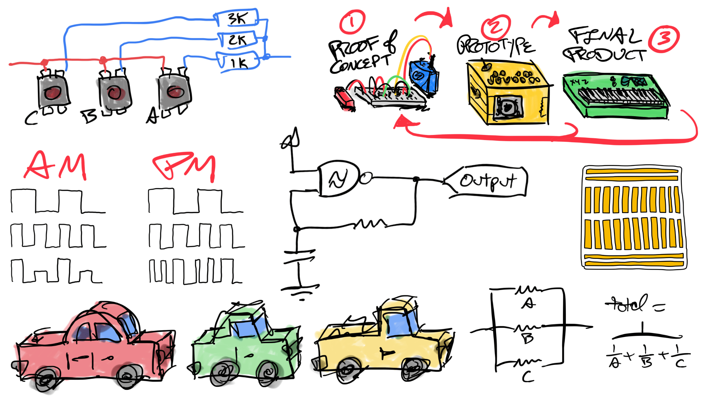

# (work)shop doc(ument)s



A couple times a year or as demand warrants it, I teach a [workshop on electronics and DIY synthesizers](https://dogbotic.com/diy-synthesizers). This repo is the source to the documents I write to share with my section.

A "live" version is available online with nice PDF downloads: [https://rocktronica.github.io/shopdocs/](https://rocktronica.github.io/shopdocs/)

Notes:

- It's mostly supplemental stuff that got cut for time but still useful/cool enough to warrant sharing.
- There is no prescribed reading order. They're kind of grab-bag "jelly bean" docs to share as topics come up.
- Despite being a real live website, format is optimized for PDF and print.
- I expect the content to change over time, so everything's dated by last update in the footer. Depending on when that was, what's online may be different from the PDFs I share in class.
- Some stuff might not make sense outside of the context of me talking about it! (Other stuff might not make sense because I wrote it very tiredly in the middle of the night without spellcheck before class in the morning.) Typos,

## Generating PDFs

Document files are written in markdown, made into a website with eleventy, and then converted to PDF with Chrome via puppeteer.

```bash
npm install

# Terminal 1
npx @11ty/eleventy --serve

# Terminal 2
node make_pdfs.js
node make_pdfs.js SLUG # for single PDF
```

Works For Me!

<!--
FOR TOMMY:
To update the website, make PDFs then run `./deploy.sh`
-->

## TODO

- Per page footers w/ page numbers

## License

Text and drawing content is all [CC BY-SA 4.0](https://creativecommons.org/licenses/by-sa/4.0/). Please retain my attribution if sharing, TYSM.

Code is MIT or as components allow.
